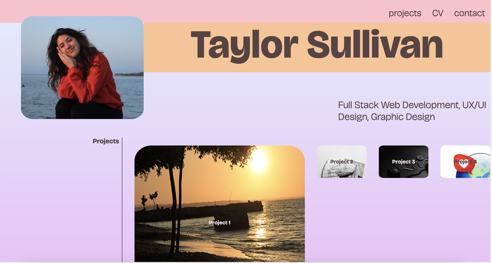

# Module 2 Challenge:

# Professional Portfolio

This challenge was to create a professional portfolio page from scratch using HTML, and CSS only. The page was to have a responsive layout, and present our numerous well-developed projects.

## Installation

In order to get the full experience, users must view the portfolio at both a desktop screen size and mobile screen size.

## Usage

You may scroll up and down on this page, click the links to jump to the content you crave, expand the size of the browswer window, or simply open the link in a mobile device.

Click this link here to see it!
https://tayskully.github.io/professional-portfolio/

It should look something like this:

## Credits

The collaborators on this project include me, myself, and Taylor
@tayskully

The code was sourced for the code refracting challenge from https://github.com/coding-boot-camp/urban-octo-telegram

Tutorials followed include Columbia University EdX's Coding Bootcamp 2023, as well as:  
 [Github Docs](https://docs.github.com/en)  
 [developer mozilla](https://developer.mozilla.org/en-US/)  
 [Dev.to](https://dev.to/)  
 [Code Academy blogs](https://www.codecademy.com/resources/blog/)  
 [W3 Schools] (https://www.w3schools.com/)

---

## Badges

